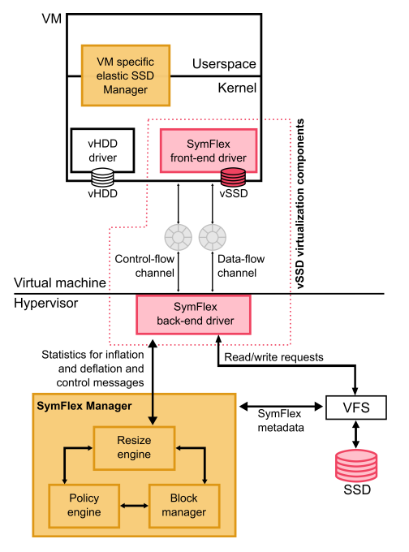

# SymFlex
Hypervisor managed SSD caching is an often used technique for
improving IO performance in virtualization based hosting solutions.
Such caches are either explicitly managed by the hypervisor which
approximate the access semantics of the applications for improving
cache utilization, or operate as statically partitioned devices (which
are utilized as caches) by virtual machines. We reason that both
these broad directions do not exploit the potential of SSD based IO
caches to the fullest, in terms of generalized management policies
and performance. We propose SymFlex, a novel method to perform
symbiotic management of IO caches by enabling elastic SSD devices. Each virtual machine is configured with an elastic virtual
SSD whose contents can be managed according to guest OS and application semantics and requirements. Furthermore, the SSD sizing
is managed by the hypervisor with a ballooning-like mechanism to
dynamically adjust SSD provisioning to VMs based on performance
and usage fairness policies. Our primary contribution of this work
is to design and engineer the mechanism for elastic SSD disks to
be virtualized, and demonstrate usage models and effectiveness of
the symbiotic management of SSD caches across virtual machines.
Through our empirical evaluation, we show that the overhead of
implementing a virtio-based elastic SSD device is minimal (within
5% of virtio based device virtualization techniques). Further, we
demonstrate using dm-cache and Fatcache, the applicability and
benefits of SymFlex for enhancing IO throughput and enforcing
VM-level SSD allocation policies.

We have implemented SymFlex using a Linux + QEMU-KVM platform. The SymFlex front end driver is implemented with Linux kernel version of 4.9.35 and the back end driver as extensions to QEMU
2.9.0.

## [Backend drivers](tree/manager/kernel_source/linux-4.9.35)  
## [Frontend drivers](tree/manager/qemu/qemu-2.9.0)
